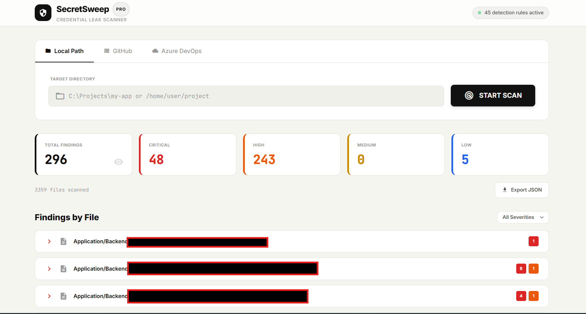

# SecretSweep

A fast, lightweight credential leak scanner that detects hardcoded secrets, API keys, tokens, and sensitive credentials in your codebase.

## Features

- **45 Detection Rules** covering AWS, Azure, GCP, GitHub, Stripe, Slack, Discord, database connection strings, private keys, JWTs, and more
- **Multiple Scan Sources** - Local directories, GitHub repos (public/private), Azure DevOps repos
- **Real-Time Progress** via Server-Sent Events (SSE)
- **Smart Filtering** - Skips binary files, `node_modules`, build artifacts, and common non-code directories
- **False Positive Reduction** - Filters out example/template strings, comments, version numbers, and placeholder values
- **Severity Classification** - Critical, High, Medium, Low
- **Export Reports** as JSON
- **Secret Masking** - Detected values are partially masked in the UI

## Quick Start

```bash
# Clone the repo
git clone https://github.com/AnuV6/SecretSweep.git
cd SecretSweep

# Install dependencies
npm install

# Start the scanner
node server.js
```

Open **http://localhost:3000** in your browser.

## Scan Sources

| Source | Description |
|--------|-------------|
| Local Path | Scan any directory on your machine |
| GitHub | Scan public or private repos (PAT optional for private) |
| Azure DevOps | Scan repos with organization, project, repo name, and PAT |

## Detection Categories

| Category | Examples |
|----------|----------|
| Cloud Provider Keys | AWS Access Key, Azure Storage Key, GCP API Key |
| Source Control Tokens | GitHub PAT, GitLab PAT, Azure DevOps PAT |
| Payment & SaaS | Stripe Secret Key, SendGrid, Twilio, Mailgun |
| Communication | Slack Webhook/Token, Discord Webhook/Bot Token |
| Database Strings | SQL Server, MySQL, PostgreSQL, MongoDB, Redis |
| Authentication | JWT, Bearer/Basic Auth headers, OAuth tokens |
| Cryptographic | RSA, OpenSSH, PGP, EC private keys |
| Generic Secrets | Hardcoded passwords, API keys, tokens |

## Tech Stack

- **Backend:** Node.js + Express
- **Frontend:** Vanilla HTML/CSS/JS + Tailwind CSS
- **Icons:** Material Icons
- **Git Operations:** simple-git

## Screenshot



## License

MIT
